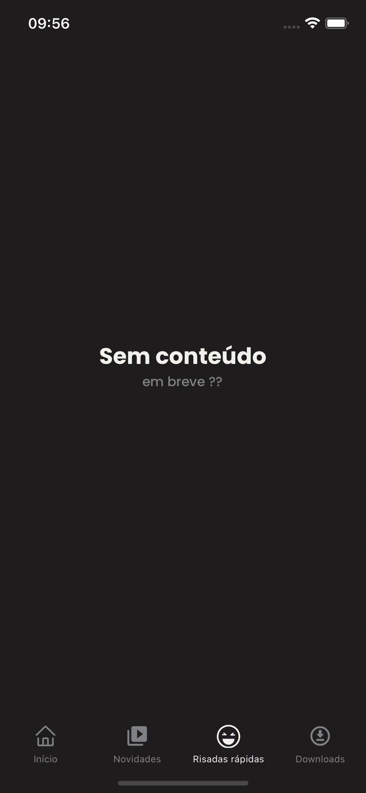

<h1 align="center">
  
  <br/>
  Netflix Clone UI
</h1>

## 🎥 Vídeos

<p align="center">
  
  
</p>
<br/>

## 💻 Projeto

Clone da interface do aplicativo da Netflix, a estrutura de pastas assim como o desenvolvimento dos componentes foi pensada principalmente na organização e separação de responsabilidades. Os commits foram realizados utilizando o padrão de **Conventional Commits**.

## 🎯 Objetivos

O objetivo principal do projeto foi a utilização de alguns pacotes específicos com o intuito de aprender como utilizá-los e aumentar o leque de conhecimento/possibilidades.

## 🖥️ Telas 
- [ ] Início
- [x] Novidades
- [ ] Risadas rápidas
- [x] Downloads
 
## ✨ Tecnologias
- React Native
- Typescript
- React Navigation Native
- React Navigation Bottom Tabs
- Axios
- React Query
- Date FNS
- Shopify Restyle
- React Native Vector Icons
- React Native Fast Image
- RN Placeholder
- Eslint
- Prettier
- MirageJS

## 🔖 Layout

O layout seguido foi baseado no aplicativo para iOS da Netflix, então por esse motivo os valores de tamanhos e espaçamentos são aproximados.

## 🤔 Observações

- O projeto foi desenvolvido utilizando diretamente a *React Native CLI*; 
- A ideia principal desse projeto era desenvolver o efeito de *sticky* presente na tela de **Novidades**. Esse efeito acontece da seguinte forma: quando o conteúdo da seção "Em breve" está visível na tela conforme o usuário realiza o *scroll*, a data no canto esquerdo da tela permanece fixa até que uma nova data apareça e assuma o lugar da mesma;
- O foco desse projeto era na utilização da biblioteca `@shopify/restyle` que tem como objetivo a criação de componentes utilizando TypeScript para facilitar o desenvolvimento assim como seu uso. Com esse pacote é possível criar diversos temas para a aplicação, manter os estilos dos componentes padronizados de acordo com o *Design System* e ainda é possível a utilização/customização de *Design Tokens* para facilitar a utilização dos componentes criados;
- Para esse projeto foi criado apenas dois componentes *cores*: `Box` e `Text`  para facilitar a customização do estilo. A partir deles foi criado os outros componentes como `Button`, `Image`, etc. 
- Para os componentes de layout foram criados:
  - `Header`: para permitir a composição do cabeçalho em diversos cenários;
  - `Screen`: é um componente construído de forma abstrata para permitir a implementação específica de qualquer outra tela baseada nessa;
  - `BasicScreen`: é a implementação do componente `Screen` utilizando também `Header`;
- O projeto possui toda a parte de comunicação separado na pasta `services` e dividida por "módulos", dessa forma é mais fácil a organização e manutenção do código. Os *services* são responsáveis apenas pela comunicação com a API e formatação de alguns dados. Foi utilizado o pacote `axios` para facilitar a configuração/comunicação com a API.
- A pasta de `hooks` é responsável por agrupar todos os *hooks* gerais da aplicação. Nesse caso os *hooks* presentes são os hooks da integração do `react-query` com os *services*, esses hooks foram criados dessa forma para que possam ser reutilizados em outras telas/componentes e também para que possam ser tratados de forma isolada. Dessa forma a manutenção e separação de responsabilidade é facilitada. 
- A pasta `screens` contém a implementação de todas as telas do projeto;
- A pasta `providers` é responsável por amazenar todo o código necessário para que cada pacote funcione corretamente, ex: o pacote `@shopify/restyle` exige a configuração do tema em volta de todos os componentes filhos ou o pacote `react-query` necessita de um `queryClient` criado por volta de todas as telas de navegação. A ideia dessa pasta é isolar cada pacote com sua configuração e código necessário, importando todos em um único ponto que seria o `RootProvider`;
- A pasta `navigation` é responsável pelos *navigators* do projeto;
- A pasta `themes` contém todos os temas desenvolvidos para o projeto.
- A pasta `helpers` agrupa um conjunto de funções gerais que podem ser utilizadas em qualquer local do projeto;
- A pasta `config` agrupa as configurações de alguns pacotes específicos do projeto de forma isolada;
- A pasta `server` foi criada para armazenar o código do pacote `miragejs` para emular uma API e fornecer os dados necessários para alimentar as telas. 
- A navegação das telas foi feita com as *Bottom Tabs* para representar apenas as principais telas do projeto;
- Foi criado um componente de `EmptyScreen` para mostrar algum tipo de conteúdo nas telas de **Início** e **Risadas rápidas**;
- Para os ícones da aplicação foi utilizada a biblioteca React Native Vector Icons;
- Para facilitar a importação do código foi configurado o recurso de *Path Aliases* que permite com que os caminhos das importações fiquem da seguinte forma `import {Theme} from '@internal/themes';`. Dessa forma, tudo que for criado nesse projeto vai possuir o prefixo `'@internal/nomeDaPasta/nomeDaSubPasta'`, facilitando assim a identificação do que é externo e interno do projeto, assim como a refatoração/movimentação de código/pastas para outras pastas sem que quebre o código nas importações; 
- O projeto utiliza a fonte "Poppins" para os textos;

## ⌨️ Executando o projeto

Utilize um dos seguintes comandos para instalar as dependências do projeto:

```cl
yarn
```

Em seguida, utilize o seguinte comando para iniciar o projeto:

```cl
yarn start
```

Para executar o projeto em um simulador iOS:

```cl
pod install
```
```cl
yarn ios
```

Para executar o projeto em um simulador Android:

```cl
yarn android
```

